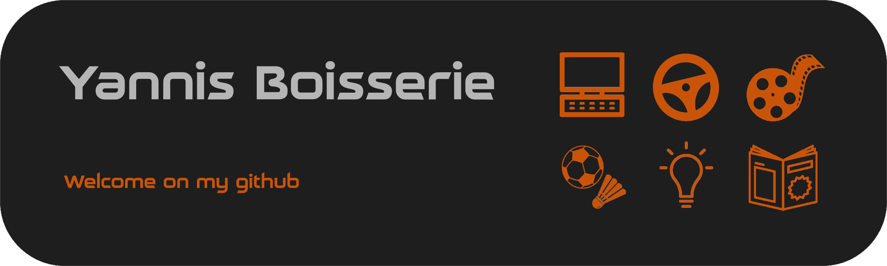

## 🎯 About Me

Hello, I am Yannis Boisserie.  
I am a third-year student pursuing a Bachelor of Technology (BUT) in Computer Science at IUT du Limousin.

---

## 💼 My Projects

| Project Name       | Description                                           | Technologies             | Links                 |
|--------------------|-------------------------------------------------------|--------------------------|-----------------------|
| The Orchard        | Digital version of the board game "The Orchard"       | Java, JavaFX             | [GitHub](#)           |
| Weather App        | Mobile weather application                            | Kotlin, REST API         | [GitHub](#)           |
| Legrand Project    | Application analyzing molding sheets to extract data | Node.js, JavaScript, HTML, CSS | [GitHub](#)    |
| Filmotheque      | Movie management app with social network features     | React, MongoDB, Cassandra | [GitHub](#)          |

---

## 🔧 Technical Skills

- **Languages**: `Python`, `JavaScript`, `Java`, `PHP`, `HTML`, `CSS`
- **Frameworks & Libraries**: `React`, `Node.js`, `Laravel`
- **Tools**: `Git`, `Docker`, `Postman`
- **Databases**: `MongoDB`, `MySQL`, `Cassandra`
- **Other**: `REST APIs`, `Unit Testing`

---

## 📫 How to Reach Me

- **Email**: [yannis.boisserie@etu.unilim.fr](mailto:yannis.boisserie@etu.unilim.fr)  
- **LinkedIn**: [Yannis Boisserie](https://www.linkedin.com/in/yannis-boisserie-2584862a4/)
