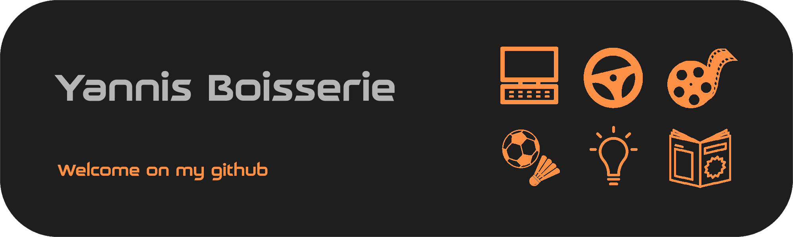

## 🎯 About Me

Hello, I am Yannis Boisserie.  
I am a third-year student pursuing a Bachelor of Technology (BUT) in Computer Science at IUT du Limousin.

---

## 💼 My Projects

| Project Name       | Description                                           | Technologies             | Links                 |
|--------------------|-------------------------------------------------------|--------------------------|-----------------------|
| The Orchard        | Digital version of the board game "The Orchard"       | Java, JavaFX             | [GitHub](#)           |
| Weather App        | Mobile weather application                            | Kotlin, REST API         | [GitHub](#)           |
| Legrand Project    | Application analyzing molding sheets to extract data | Node.js, JavaScript, HTML, CSS | [GitHub](#)    |
| Filmotheque      | Movie management app with social network features     | React, Express, MongoDB, Cassandra | [GitHub](#)          |

---

## 🔧 Technical Skills

- **Languages**:  
            
- **Frameworks**:  
   
- **Databases**:  
     
- **Operating Systems**:  
    
- **Virtualization**:  
   
- **Servers**:  
    
- **Methods & Tools**:  
       
## 📫 How to Reach Me

- **Email**: [yannis.boisserie@etu.unilim.fr](mailto:yannis.boisserie@etu.unilim.fr)  
- **LinkedIn**: [Yannis Boisserie](https://www.linkedin.com/in/yannis-boisserie-2584862a4/)
